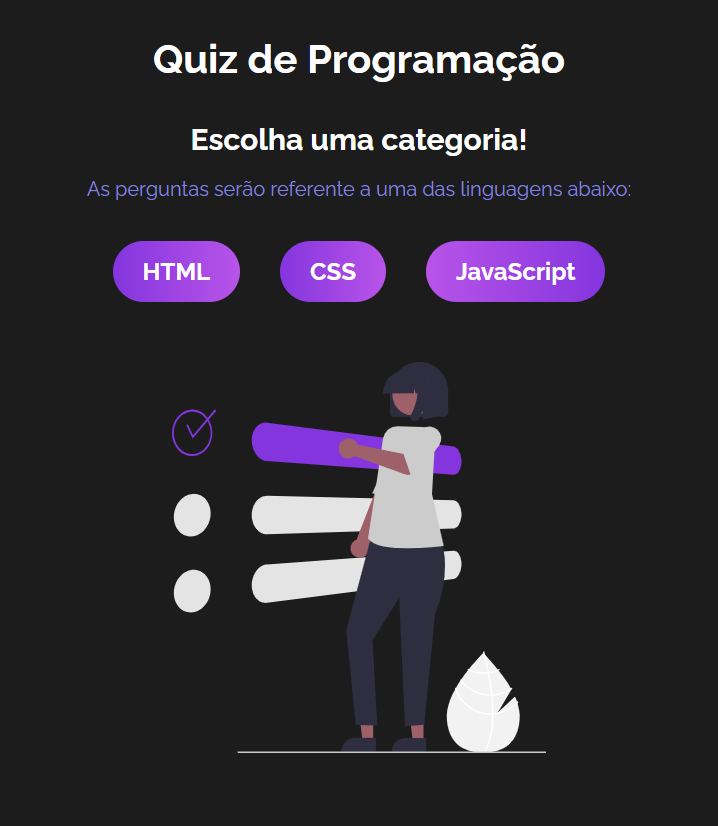
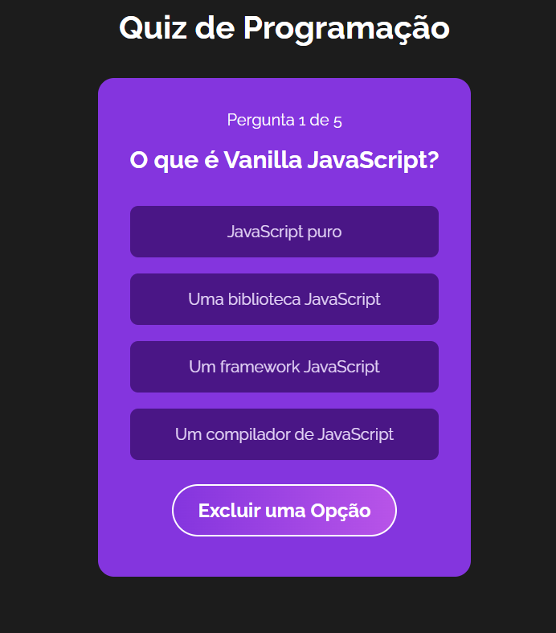

<h1 align="center">
    
    <br>
</h1>

## 📚Sobre

**QUIZ DE PROGRAMAÇÃO** é um projeto que foi desenvolvido no curso de React da comunidade hora de codar , neste projeto utilizamos ReactJS utilizando Hooks como : useReducer , useEffect e context api.

## 💻Veja o projeto Online
[ACESSE O DEPLOY CLICANDO AQUI!](https://quiz-nine-opal.vercel.app/)

## 🏜️ Fotos do projeto
<div align="center">
    
    
    
</div>


## 🔨Ferramentas

- React.JS
-- CSS


## Como executar o projeto
```bash
    # clone o projeto
    git clone https://github.com/matheuspeluso/Quiz.git

    #entrar na pasta do projeto
    cd Quiz

    #instalação das dependencias usando npm 
    npm install 

    #para executar o sistema 
    npm run dev
    
```
## Autor do projeto
<p>Matheus Pereira Peluso do Nascimento</p>
<p>Email para contato: matheuspeluso17@gmail.com</p>
<p>Telefone para contato: +55 (21)99385-7520</p>

